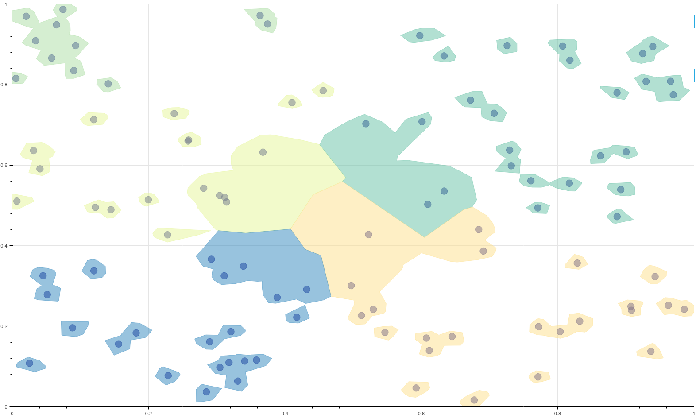

# GMap

Python implementation of GMap algorithm[\[1\]](#ref) for data visualization.

# Usage

For a quick example using the Bokeh library, call the module itself.:

    python gmap.py

To use it in your project, import it as with any other python module.

    import gmap
    
    gmap.gmap(data_points, outliers, labels)

The result of the example:

# Reference 

<a name="ref">[1]</a> E. R. Gansner, Y. Hu and S. Kobourov, "[GMap: Visualizing graphs and clusters as maps](https:www.doi.org/10.1109/PACIFICVIS.2010.5429590)," 2010 IEEE Pacific Visualization Symposium (PacificVis), 2010, pp. 201-208, doi: 10.1109/PACIFICVIS.2010.5429590.

